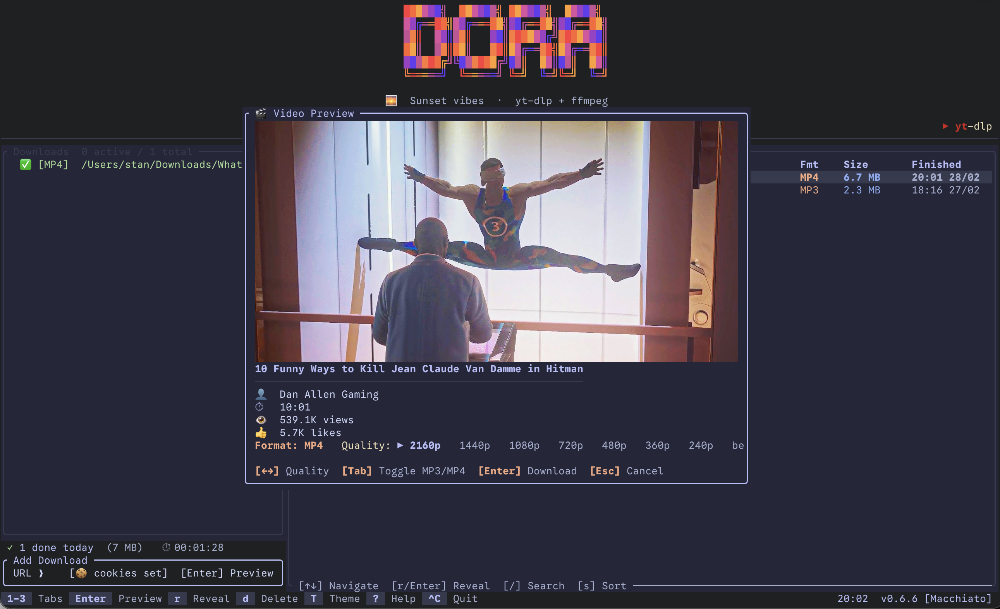

<div align="center">


# doradura

**Two ways to download the internet. One codebase. Pure Rust.**

[](https://www.rust-lang.org/)
[](https://t.me/DoraDuraDoraDuraBot?start)
[](https://github.com/Jacke/doradura)
[](LICENSE)

</div>

---

A media-download ecosystem built entirely in Rust. Two production products share one high-performance core:

- **dora** — a Catppuccin-themed terminal client for your desktop
- **doradura bot** — a Telegram bot with audio FX, 9+ output formats, and 1000+ supported platforms



## dora — Terminal Media Downloader

A pixel-perfect TUI built with **ratatui** and the **Catppuccin Mocha** palette — 7 logo themes, full mouse support, 60 fps.

**Paste a URL → preview with ASCII thumbnail → pick quality → download.** History, lyrics search, and persistent settings included.

### Install

```bash
# macOS
brew tap Jacke/dora && brew install dora

# Ubuntu / Debian
curl -fsSL https://iamjacke.com/doradura/KEY.gpg | sudo gpg --dearmor -o /etc/apt/keyrings/dora.gpg
echo "deb [signed-by=/etc/apt/keyrings/dora.gpg] https://iamjacke.com/doradura stable main" \
  | sudo tee /etc/apt/sources.list.d/dora.list
sudo apt update && sudo apt install dora

# Arch Linux
yay -S dora-bin

# From source
cargo install --path crates/doratui
```

> **Requires:** [`yt-dlp`](https://github.com/yt-dlp/yt-dlp) and [`ffmpeg`](https://ffmpeg.org)

---

## doradura — Telegram Bot

YouTube · SoundCloud · TikTok · Instagram · VK · Spotify · Bandcamp · Twitter/X · and **1000+ more** via yt-dlp.

| Formats | Audio FX (Premium) | Features |
|---|---|---|
| MP3 · MP4 · WAV · FLAC · OGG · M4A | Pitch · Tempo · Bass Boost | Video notes (auto-split circles) |
| GIF · SRT · Opus · AAC | Lofi · Wide · Morph profiles | Ringtones (iPhone `.m4r` / Android) |
| 128k–320k audio · up to 4K video | | Archive ZIP download of history |
| | | Share pages with streaming links |

**Commands:** `/start` · `/download <url>` · `/info <url>` · `/history` · `/settings` · `/plan`

**Languages:** English · Русский · Français · Deutsch

### Self-host

```bash
cp .env.example .env   # add TELOXIDE_TOKEN, TELEGRAM_API_ID/HASH, ADMIN_USERNAME
cargo run -p doradura
```

Or deploy with Docker / Railway:

```bash
# Docker
docker build -t doradura .
docker run -e TELOXIDE_TOKEN=... -e TELEGRAM_API_ID=... \
           -e TELEGRAM_API_HASH=... -v doradura-data:/data doradura

# Railway — just connect repo and set env vars, auto-deploy on push
railway up
```

<details>
<summary><strong>Environment variables</strong></summary>

| Variable | Required | Description |
|----------|:--------:|-------------|
| `TELOXIDE_TOKEN` | ✅ | Telegram bot token |
| `TELEGRAM_API_ID` | ✅ | Telegram API ID |
| `TELEGRAM_API_HASH` | ✅ | Telegram API hash |
| `ADMIN_USERNAME` | ✅ | Bot username (without @) |
| `DATABASE_URL` | | SQLite path (default: `/data/database.sqlite`) |
| `WARP_PROXY` | | SOCKS5 proxy — **required** for YouTube on Railway |
| `BOT_API_URL` | | Local Bot API for files up to 2 GB |
| `WEB_BASE_URL` | | Base URL for share pages & admin dashboard |
| `DOWNSUB_GRPC_ENDPOINT` | | Subtitle service endpoint |

</details>

---

## Architecture

```
doradura/
├── crates/
│   ├── doracore/      Shared library — download pipeline, storage, i18n, lyrics
│   │   ├── download/  SourceRegistry → YtDlpSource / HttpSource → Pipeline
│   │   ├── storage/   SQLite + Postgres (SharedStorage), migrations, TempDirGuard
│   │   └── core/      Config, web server (share pages + admin), metrics
│   │
│   ├── health-monitor/  Bot health watchdog — auto-recovers title & checks /health
│   │
│   ├── dorabot/       Telegram bot — handlers, menus, callbacks, audio/video
│   │
│   └── doratui/       Terminal UI — ratatui, settings, preview, lyrics
│
├── locales/           Fluent i18n (en, ru, fr, de)
├── migrations/        39 SQLite migrations
└── Dockerfile         Multi-stage build (cargo-chef + s6-overlay runtime)
```

### Tech stack

| | |
|---|---|
| **Language** | Rust 1.93+ · async Tokio |
| **TUI** | ratatui · crossterm · Catppuccin Mocha |
| **Telegram** | teloxide · local Bot API support |
| **Database** | SQLite + Postgres (SharedStorage) · rusqlite · sqlx · Redis |
| **Media** | FFmpeg · yt-dlp (nightly + Deno) |
| **Web** | Axum · HMAC-SHA256 Telegram auth |
| **Observability** | Tracing with per-task op IDs · Prometheus metrics · health monitor |
| **Deploy** | Railway · Docker · s6-overlay |
| **i18n** | fluent-templates (4 languages) |

---

## Docs

| | |
|---|---|
| [EXTENDING_SOURCES.md](docs/EXTENDING_SOURCES.md) | Add custom download backends |
| [SUBSCRIPTIONS.md](docs/SUBSCRIPTIONS.md) | Subscription tier management |
| [PROXY_SYSTEM.md](docs/PROXY_SYSTEM.md) | WARP/Tailscale proxy for YouTube |
| [HEALTH_CHECK.md](docs/HEALTH_CHECK.md) | Health monitoring & avatar status |
| [YTDLP.md](docs/YTDLP.md) | yt-dlp setup, updates & troubleshooting |

---

<div align="center">

MIT License · Made with Rust · [Jacke/doradura](https://github.com/Jacke/doradura)

*Download anything. From anywhere. Beautifully.*

</div>
