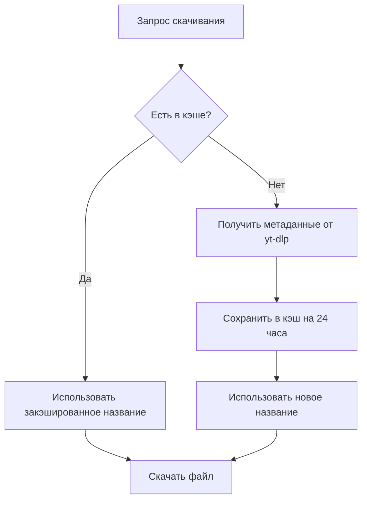

# Проблема с кэшированием метаданных "Unknown Track"

## Проблема

После исправления получения метаданных видео все еще скачиваются с именем "Unknown Track.mp4" или "Unknown.mp4".

## Причина

**Кэш метаданных живет 24 часа!**

```rust
// src/cache.rs
static METADATA_CACHE: once_cell::sync::Lazy<MetadataCache> = once_cell::sync::Lazy::new(|| {
    MetadataCache::new(Duration::from_secs(24 * 60 * 60)) // 24 часа ⏰
});
```

Это означает:
1. Если раньше видео скачивалось с ошибкой → получило название "Unknown Track"
2. Это значение **сохранилось в кэше** на 24 часа
3. Все последующие скачивания этого же видео используют **закэшированное название** из кэша
4. Даже если код исправлен, старое "Unknown Track" будет использоваться до истечения срока кэша

## Решения

### Решение 1: Перезапуск бота (САМОЕ ПРОСТОЕ) ⚡

Кэш метаданных хранится **в памяти** приложения, поэтому:

```bash
# Остановите бота
pkill -f doradura
# или нажмите Ctrl+C если запущен в терминале

# Запустите бота снова
./target/release/doradura
# или
cargo run --release
```

**После перезапуска кэш полностью очищается!** ✨

### Решение 2: Используйте скрипт очистки

```bash
chmod +x clear_cache.sh
./clear_cache.sh
```

Скрипт даст инструкции по очистке кэша.

### Решение 3: Подождите 24 часа ⏳

Кэш автоматически истечёт через 24 часа с момента кэширования.

### Решение 4: Попробуйте другое видео 🎬

Если видео **никогда раньше не скачивалось**, его метаданных нет в кэше, и оно получит правильное название с первого раза.

## Проверка

После перезапуска бота проверьте логи:

```bash
# Запустите с отладочным логированием
export RUST_LOG=doradura=debug
./target/release/doradura

# Скачайте видео и посмотрите логи
```

Вы должны увидеть:
```
[INFO] Successfully got metadata for video - title: 'Реальное название видео', artist: ''
[DEBUG] Generating filename: title='Реальное название видео' (len=45), artist='' (len=0), ext='mp4'
[DEBUG] Using title only: 'Реальное название видео.mp4'
[INFO] Generated filename for video: 'Реальное название видео.mp4'
```

## Как кэш работает



## Улучшения (для будущего)

### 1. Уменьшить время жизни кэша

Вместо 24 часов можно использовать, например, 1 час:

```rust
// src/cache.rs
static METADATA_CACHE: once_cell::sync::Lazy<MetadataCache> = once_cell::sync::Lazy::new(|| {
    MetadataCache::new(Duration::from_secs(60 * 60)) // 1 час
});
```

### 2. Не кэшировать ошибочные результаты

Можно изменить логику, чтобы не кэшировать "Unknown Track":

```rust
// src/downloader.rs
// После получения метаданных
if !title.is_empty() && title != "Unknown Track" {
    cache::cache_metadata(url, title.clone(), artist.clone()).await;
}
```

### 3. Добавить команду очистки кэша

Можно добавить команду бота `/clearcache` для ручной очистки.

### 4. Инвалидация при ошибке

Если получение метаданных завершилось ошибкой, удалять эту запись из кэша:

```rust
if let Err(e) = get_metadata_from_ytdlp(&url).await {
    // Удалить из кэша если была ошибка
    cache::invalidate_cached_metadata(&url).await;
    return Err(e);
}
```

## Текущее состояние

✅ **Код исправлен** - новые видео будут получать правильные названия  
⚠️ **Кэш может хранить старые значения** - нужен перезапуск  
✅ **Добавлено подробное логирование** - можно диагностировать проблемы  
✅ **Создан скрипт clear_cache.sh** - для удобной очистки  

## TL;DR (Кратко)

**Проблема:** Старые "Unknown Track" сохранены в кэше на 24 часа  
**Решение:** Перезапустите бота (кэш в памяти, очистится автоматически)  
**Проверка:** Скачайте видео и проверьте логи с `RUST_LOG=doradura=debug`

