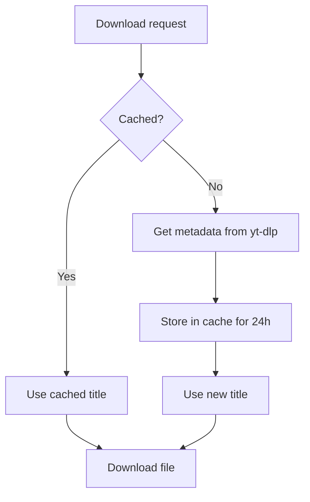

# Metadata Cache Issue: "Unknown Track"

## Problem
After fixing metadata retrieval, some downloads still produced `Unknown Track.mp4` or `Unknown.mp4`.

## Cause
**The metadata cache lives for 24 hours!**

```rust
// src/cache.rs
static METADATA_CACHE: once_cell::sync::Lazy<MetadataCache> = once_cell::sync::Lazy::new(|| {
    MetadataCache::new(Duration::from_secs(24 * 60 * 60)) // 24 hours ⏰
});
```

That means:
1. An earlier failed download cached the title as "Unknown Track".
2. The value **stays in cache** for 24 hours.
3. All later downloads of the same URL reuse the **cached title**.
4. Even with fixed code, the old value persists until the cache expires.

## Fixes

### Fix 1: Restart the bot (EASIEST) ⚡

The metadata cache is **in-memory**:

```bash
pkill -f doradura   # or press Ctrl+C
./target/release/doradura
# or
cargo run --release
```

**A restart fully clears the cache.** ✨

### Fix 2: Use the cleanup script

```bash
chmod +x clear_cache.sh
./scripts/clear_cache.sh
```
The script provides cache-clean instructions.

### Fix 3: Wait 24 hours ⏳
The cache expires automatically after 24 hours.

### Fix 4: Try another video 🎬
If a video **has never been downloaded**, it is not cached and will get the correct title immediately.

## Verification

After restarting, check logs:

```bash
export RUST_LOG=doradura=debug
./target/release/doradura
# download a video and inspect logs
```

Expected:
```
[INFO] Successfully got metadata for video - title: 'Actual Title', artist: ''
[DEBUG] Generating filename: title='Actual Title' (len=45), artist='' (len=0), ext='mp4'
[DEBUG] Using title only: 'Actual Title.mp4'
[INFO] Generated filename for video: 'Actual Title.mp4'
```

## How the cache works



## Possible improvements

### 1. Shorter cache lifetime

```rust
static METADATA_CACHE: once_cell::sync::Lazy<MetadataCache> = once_cell::sync::Lazy::new(|| {
    MetadataCache::new(Duration::from_secs(60 * 60)) // 1 hour
});
```

### 2. Do not cache error results

```rust
// src/downloader.rs
if !title.is_empty() && title != "Unknown Track" {
    cache::cache_metadata(url, title.clone(), artist.clone()).await;
}
```

### 3. Add a cache-clear command
Add a `/clearcache` bot command for manual purge.

### 4. Invalidate on error

```rust
if let Err(e) = get_metadata_from_ytdlp(&url).await {
    cache::invalidate_cached_metadata(&url).await;
    return Err(e);
}
```

## Current state

✅ **Code fixed** — new videos get correct titles
⚠️ **Cache may hold old values** — restart needed
✅ **Detailed logging added** — easier diagnostics
✅ **`clear_cache.sh` provided** — quick cleanup

## TL;DR
**Problem:** old "Unknown Track" entries live for 24 hours.  
**Fix:** restart the bot (in-memory cache clears).  
**Check:** download a video and inspect logs with `RUST_LOG=doradura=debug`.
