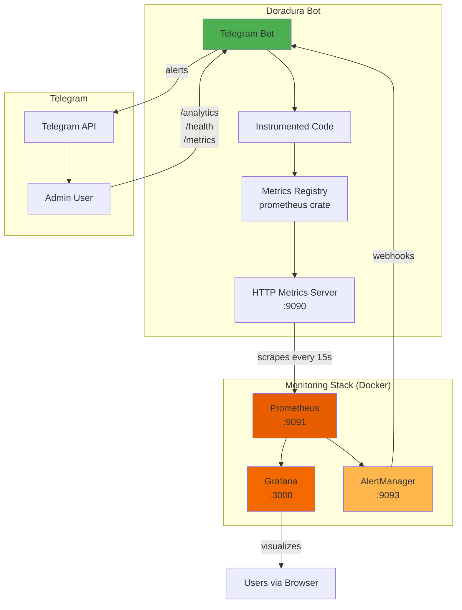
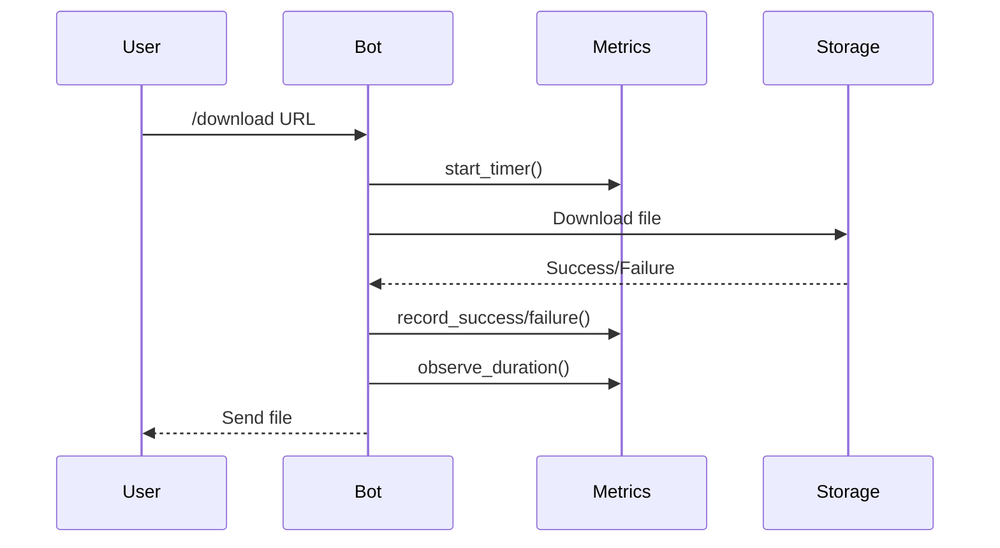
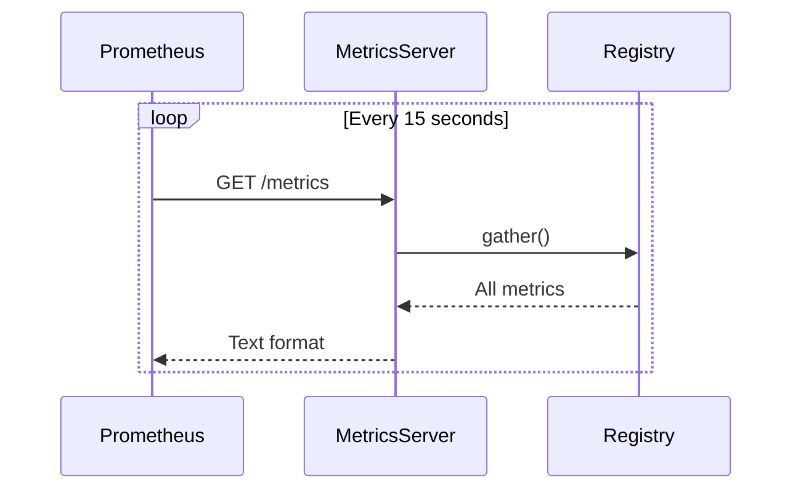
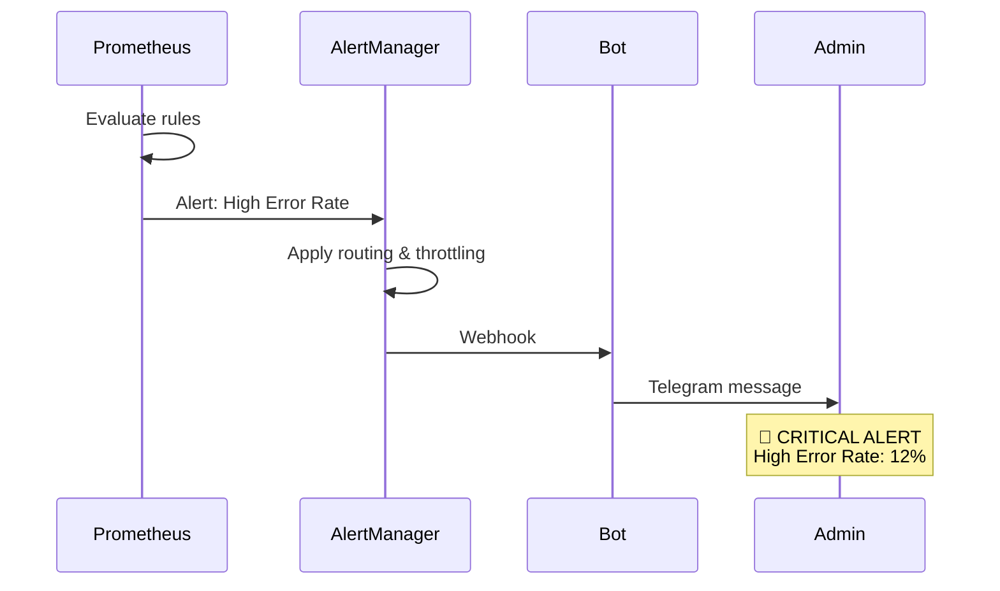

# 📊 Архитектура Системы Мониторинга

## Обзор



## Поток Данных

### 1. Сбор Метрик



### 2. Экспорт Метрик



### 3. Алертинг



## Компоненты

### Metrics Registry (In-Memory)

```rust
lazy_static! {
    pub static ref DOWNLOAD_DURATION_SECONDS: HistogramVec = register_histogram_vec!(
        "doradura_download_duration_seconds",
        "Time spent downloading files",
        &["format", "quality"]
    ).unwrap();

    pub static ref DOWNLOAD_SUCCESS_TOTAL: CounterVec = register_counter_vec!(
        "doradura_download_success_total",
        "Total successful downloads",
        &["format", "quality"]
    ).unwrap();
}
```

**Характеристики:**
- 🚀 Очень быстро (<0.1% overhead)
- 💾 Хранится в памяти процесса
- 🔒 Thread-safe (Atomic operations)
- 📊 Автоматическая агрегация

### HTTP Metrics Server (Axum)

```
GET /metrics  → Prometheus text format
GET /health   → JSON health status
GET /         → Service info
```

**Особенности:**
- ⚡ Асинхронный (Tokio + Axum)
- 🔓 Открыт для Prometheus (0.0.0.0:9090)
- 📝 Стандартный Prometheus exposition format

### Prometheus

**Конфигурация:**
- Scrape interval: 15s
- Retention: 30 дней
- Storage: TSDB (time-series database)

**Recording Rules:**
```promql
doradura:download_success_rate:5m
doradura:error_rate:5m
doradura:download_duration:p95:5m
```

Позволяют быстро вычислять часто используемые метрики.

### Grafana

**Provisioning:**
- Datasource настраивается автоматически
- Dashboard импортируется при старте
- Не нужна ручная настройка

**Dashboard Панели:**
1. Download Rate (timeseries)
2. Success Rate (gauge)
3. Queue Depth (stat)
4. Duration Percentiles (timeseries)
5. Downloads by Format (bars)
6. DAU/MAU (stat)
7. Revenue (stat)
8. Errors by Category (timeseries)

### AlertManager

**Routing:**
```yaml
Critical alerts → Immediate notification
Warning alerts  → Grouped, 30s delay
```

**Throttling:**
- Payment failures: нет throttle (немедленно)
- High error rate: 30 минут между алертами
- Queue backup: 15 минут

## Типы Метрик

### Counter (только растет)

```rust
DOWNLOAD_SUCCESS_TOTAL.with_label_values(&["mp3", "320k"]).inc();
```

**Используется для:**
- Количество загрузок
- Количество ошибок
- Revenue

### Gauge (может расти и падать)

```rust
QUEUE_DEPTH.set(current_queue_size as f64);
```

**Используется для:**
- Глубина очереди
- Активные пользователи
- Активные подписки

### Histogram (распределение значений)

```rust
let timer = DOWNLOAD_DURATION_SECONDS
    .with_label_values(&["mp3", "320k"])
    .start_timer();
// ... download ...
timer.observe_duration();
```

**Используется для:**
- Длительность загрузок
- Время ожидания в очереди

**Генерирует:**
- `_bucket{le="1"}` - количество значений ≤ 1
- `_bucket{le="5"}` - количество значений ≤ 5
- `_sum` - сумма всех значений
- `_count` - количество наблюдений

**Позволяет вычислять:**
- Percentiles (p50, p95, p99)
- Средние значения
- Распределение

## Примеры Запросов

### Простые

```promql
# Текущая глубина очереди
doradura_queue_depth

# Всего загрузок (с начала)
doradura_download_success_total

# DAU
doradura_daily_active_users
```

### Rate (за период)

```promql
# Загрузок в секунду (за последние 5 минут)
rate(doradura_download_success_total[5m])

# Ошибок в секунду
rate(doradura_errors_total[5m])
```

### Агрегация

```promql
# Всего загрузок в секунду (все форматы)
sum(rate(doradura_download_success_total[5m]))

# По формату
sum by (format) (rate(doradura_download_success_total[5m]))
```

### Вычисления

```promql
# Success rate (%)
sum(rate(doradura_download_success_total[5m])) /
(sum(rate(doradura_download_success_total[5m])) +
 sum(rate(doradura_download_failure_total[5m]))) * 100

# Медианная длительность
histogram_quantile(0.5,
  rate(doradura_download_duration_seconds_bucket[5m]))

# 95-й перцентиль
histogram_quantile(0.95,
  rate(doradura_download_duration_seconds_bucket[5m]))
```

## Безопасность

### Development

```
Metrics Server: 0.0.0.0:9090 (открыт для localhost)
Prometheus:     127.0.0.1:9091 (только localhost)
Grafana:        127.0.0.1:3000 (только localhost)
```

### Production

**Опция 1: Internal Network**
```
Metrics Server: 0.0.0.0:9090 (internal Railway network)
Prometheus:     Отдельный сервис
Access:         Только через VPN или internal domains
```

**Опция 2: Authentication**
```rust
// Добавить basic auth в metrics server
.layer(middleware::from_fn(basic_auth_middleware))
```

**Опция 3: IP Whitelist**
```rust
// Разрешить только Prometheus IP
if !allowed_ips.contains(&client_ip) {
    return StatusCode::FORBIDDEN;
}
```

## Производительность

### Overhead

- **CPU**: <0.1% (atomic operations очень быстрые)
- **Memory**: ~1-10 MB (зависит от количества label combinations)
- **Network**: ~50-100 KB per scrape (зависит от количества метрик)

### Оптимизация

1. **Limit cardinality** - не создавайте бесконечные labels
   ```rust
   // ❌ Плохо (бесконечная cardinality)
   METRIC.with_label_values(&[user_id, url])

   // ✅ Хорошо (ограниченная cardinality)
   METRIC.with_label_values(&[format, quality])
   ```

2. **Use recording rules** для сложных запросов

3. **Set retention policy** чтобы не хранить метрики вечно

## Масштабирование

### Вертикальное

- Больше retention → больше RAM (Prometheus)
- Больше метрик → больше RAM (Bot)

### Горизонтальное

**Multi-instance Bot:**
```yaml
scrape_configs:
  - job_name: 'doradura-bot'
    static_configs:
      - targets:
          - 'bot-instance-1:9090'
          - 'bot-instance-2:9090'
          - 'bot-instance-3:9090'
```

Prometheus автоматически агрегирует метрики с разных инстансов.

**Federation (несколько Prometheus):**
```yaml
scrape_configs:
  - job_name: 'federate'
    honor_labels: true
    metrics_path: '/federate'
    params:
      'match[]':
        - '{job="doradura-bot"}'
    static_configs:
      - targets:
          - 'prometheus-us:9090'
          - 'prometheus-eu:9090'
```

## Best Practices

1. **Naming conventions**
   ```
   {namespace}_{metric}_{unit}
   doradura_download_duration_seconds
   ```

2. **Labels vs Metrics**
   ```rust
   // ✅ Хорошо - один metric, разные labels
   DOWNLOADS.with_label_values(&["mp3"])
   DOWNLOADS.with_label_values(&["mp4"])

   // ❌ Плохо - разные metrics
   MP3_DOWNLOADS
   MP4_DOWNLOADS
   ```

3. **Always include unit in name**
   ```
   _seconds, _bytes, _total, _ratio
   ```

4. **Use summary only if needed**
   - Histogram почти всегда лучше
   - Summary не агрегируется между инстансами

5. **Test your PromQL queries**
   - Используйте Prometheus UI для тестирования
   - Проверяйте на production data

## Troubleshooting

### High Memory Usage

```bash
# Уменьшить retention
--storage.tsdb.retention.time=7d

# Увеличить scrape interval
scrape_interval: 30s
```

### Missing Metrics

```bash
# Проверить что метрики создаются
curl localhost:9090/metrics | grep doradura

# Проверить targets
curl localhost:9091/api/v1/targets

# Проверить logs
docker logs doradura-prometheus
```

### Slow Queries

- Используйте recording rules
- Уменьшите time range
- Добавьте больше RAM Prometheus

## Мониторинг Мониторинга

Да, мы мониторим мониторинг! 😄

```promql
# Prometheus использование памяти
process_resident_memory_bytes{job="prometheus"}

# Количество активных timeseries
prometheus_tsdb_head_series

# Scrape duration
prometheus_target_interval_length_seconds
```

---

**Итого:** Полнофункциональная система мониторинга, готовая к production! 🚀
