# Monitoring System Architecture

## Overview


## Data Flow

### 1. Metrics Collection


### 2. Metrics Export


### 3. Alerting

```mermaid
sequenceDiagram
    participant Prometheus
    participant AlertManager
    participant Bot
    participant Admin

    Prometheus->>Prometheus: Evaluate rules
    Prometheus->>AlertManager: Alert: High Error Rate
    AlertManager->>AlertManager: Apply routing & throttling
    AlertManager->>Bot: Webhook
    Bot->>Admin: Telegram message

    Note over Admin: 🔴 CRITICAL ALERT<br/>High Error Rate: 12%
```



## Components

### Metrics Registry (In-Memory)

```rust
lazy_static! {
    pub static ref DOWNLOAD_DURATION_SECONDS: HistogramVec = register_histogram_vec!(
        "doradura_download_duration_seconds",
        "Time spent downloading files",
        &["format", "quality"]
    ).unwrap();

    pub static ref DOWNLOAD_SUCCESS_TOTAL: CounterVec = register_counter_vec!(
        "doradura_download_success_total",
        "Total successful downloads",
        &["format", "quality"]
    ).unwrap();
}
```

**Characteristics:**
- Very fast (<0.1% overhead)
- Stored in process memory
- Thread-safe (Atomic operations)
- Automatic aggregation

### HTTP Metrics Server (Axum)

```
GET /metrics  → Prometheus text format
GET /health   → JSON health status
GET /         → Service info
```

**Features:**
- Asynchronous (Tokio + Axum)
- Open for Prometheus (0.0.0.0:9090)
- Standard Prometheus exposition format

### Prometheus

**Configuration:**
- Scrape interval: 15s
- Retention: 30 days
- Storage: TSDB (time-series database)

**Recording Rules:**
```promql
doradura:download_success_rate:5m
doradura:error_rate:5m
doradura:download_duration:p95:5m
```

Allow fast computation of frequently used metrics.

### Grafana

**Provisioning:**
- Datasource configured automatically
- Dashboard imported on startup
- No manual configuration required

**Dashboard Panels:**
1. Download Rate (timeseries)
2. Success Rate (gauge)
3. Queue Depth (stat)
4. Duration Percentiles (timeseries)
5. Downloads by Format (bars)
6. DAU/MAU (stat)
7. Revenue (stat)
8. Errors by Category (timeseries)

### AlertManager

**Routing:**
```yaml
Critical alerts → Immediate notification
Warning alerts  → Grouped, 30s delay
```

**Throttling:**
- Payment failures: no throttle (immediate)
- High error rate: 30 minutes between alerts
- Queue backup: 15 minutes

## Metric Types

### Counter (only increases)

```rust
DOWNLOAD_SUCCESS_TOTAL.with_label_values(&["mp3", "320k"]).inc();
```

**Used for:**
- Download count
- Error count
- Revenue

### Gauge (can increase and decrease)

```rust
QUEUE_DEPTH.set(current_queue_size as f64);
```

**Used for:**
- Queue depth
- Active users
- Active subscriptions

### Histogram (value distribution)

```rust
let timer = DOWNLOAD_DURATION_SECONDS
    .with_label_values(&["mp3", "320k"])
    .start_timer();
// ... download ...
timer.observe_duration();
```

**Used for:**
- Download duration
- Queue wait time

**Generates:**
- `_bucket{le="1"}` - count of values <= 1
- `_bucket{le="5"}` - count of values <= 5
- `_sum` - sum of all values
- `_count` - number of observations

**Allows computing:**
- Percentiles (p50, p95, p99)
- Averages
- Distribution

## Query Examples

### Simple

```promql
# Current queue depth
doradura_queue_depth

# Total downloads (since start)
doradura_download_success_total

# DAU
doradura_daily_active_users
```

### Rate (over period)

```promql
# Downloads per second (over last 5 minutes)
rate(doradura_download_success_total[5m])

# Errors per second
rate(doradura_errors_total[5m])
```

### Aggregation

```promql
# Total downloads per second (all formats)
sum(rate(doradura_download_success_total[5m]))

# By format
sum by (format) (rate(doradura_download_success_total[5m]))
```

### Calculations

```promql
# Success rate (%)
sum(rate(doradura_download_success_total[5m])) /
(sum(rate(doradura_download_success_total[5m])) +
 sum(rate(doradura_download_failure_total[5m]))) * 100

# Median duration
histogram_quantile(0.5,
  rate(doradura_download_duration_seconds_bucket[5m]))

# 95th percentile
histogram_quantile(0.95,
  rate(doradura_download_duration_seconds_bucket[5m]))
```

## Security

### Development

```
Metrics Server: 0.0.0.0:9090 (open for localhost)
Prometheus:     127.0.0.1:9091 (localhost only)
Grafana:        127.0.0.1:3000 (localhost only)
```

### Production

**Option 1: Internal Network**
```
Metrics Server: 0.0.0.0:9090 (internal Railway network)
Prometheus:     Separate service
Access:         Only via VPN or internal domains
```

**Option 2: Authentication**
```rust
// Add basic auth to metrics server
.layer(middleware::from_fn(basic_auth_middleware))
```

**Option 3: IP Whitelist**
```rust
// Allow only Prometheus IP
if !allowed_ips.contains(&client_ip) {
    return StatusCode::FORBIDDEN;
}
```

## Performance

### Overhead

- **CPU**: <0.1% (atomic operations are very fast)
- **Memory**: ~1-10 MB (depends on number of label combinations)
- **Network**: ~50-100 KB per scrape (depends on number of metrics)

### Optimization

1. **Limit cardinality** - do not create unbounded labels
   ```rust
   // Bad (infinite cardinality)
   METRIC.with_label_values(&[user_id, url])

   // Good (bounded cardinality)
   METRIC.with_label_values(&[format, quality])
   ```

2. **Use recording rules** for complex queries

3. **Set retention policy** to avoid storing metrics forever

## Scaling

### Vertical

- More retention → more RAM (Prometheus)
- More metrics → more RAM (Bot)

### Horizontal

**Multi-instance Bot:**
```yaml
scrape_configs:
  - job_name: 'doradura-bot'
    static_configs:
      - targets:
          - 'bot-instance-1:9090'
          - 'bot-instance-2:9090'
          - 'bot-instance-3:9090'
```

Prometheus automatically aggregates metrics from different instances.

**Federation (multiple Prometheus instances):**
```yaml
scrape_configs:
  - job_name: 'federate'
    honor_labels: true
    metrics_path: '/federate'
    params:
      'match[]':
        - '{job="doradura-bot"}'
    static_configs:
      - targets:
          - 'prometheus-us:9090'
          - 'prometheus-eu:9090'
```

## Best Practices

1. **Naming conventions**
   ```
   {namespace}_{metric}_{unit}
   doradura_download_duration_seconds
   ```

2. **Labels vs Metrics**
   ```rust
   // Good - one metric, different labels
   DOWNLOADS.with_label_values(&["mp3"])
   DOWNLOADS.with_label_values(&["mp4"])

   // Bad - separate metrics
   MP3_DOWNLOADS
   MP4_DOWNLOADS
   ```

3. **Always include unit in name**
   ```
   _seconds, _bytes, _total, _ratio
   ```

4. **Use summary only if needed**
   - Histogram is almost always better
   - Summary does not aggregate across instances

5. **Test your PromQL queries**
   - Use Prometheus UI for testing
   - Verify against production data

## Troubleshooting

### High Memory Usage

```bash
# Reduce retention
--storage.tsdb.retention.time=7d

# Increase scrape interval
scrape_interval: 30s
```

### Missing Metrics

```bash
# Check that metrics are being created
curl localhost:9090/metrics | grep doradura

# Check targets
curl localhost:9091/api/v1/targets

# Check logs
docker logs doradura-prometheus
```

### Slow Queries

- Use recording rules
- Reduce time range
- Add more RAM to Prometheus

## Monitoring the Monitor

Yes, we monitor the monitoring!

```promql
# Prometheus memory usage
process_resident_memory_bytes{job="prometheus"}

# Number of active timeseries
prometheus_tsdb_head_series

# Scrape duration
prometheus_target_interval_length_seconds
```

---

**Summary:** A fully functional monitoring system, production-ready!
